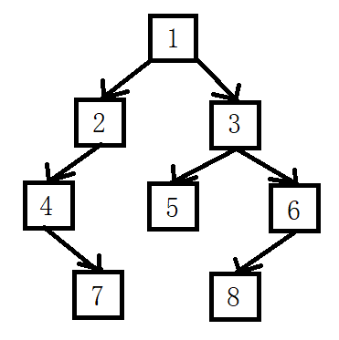

# 重建二叉树

## 题目

输入某二叉树的前序遍历和中序遍历的结果，请重建该二叉树。假设输入的前序遍历和中序遍历的结果中都不含重复的数字。例如，输入前序遍历序列{1，2，4，7，3，5，6，8}和中序遍历序列{4，7，2，1，5，3，8，6}，则重建如图1所示的二叉树并输出它的头节点。

<div align=center>

</div>

二叉树节点的定义如下：

```c++
struct BinaryTreeNode
{
    int m_nValue;
    BinaryTreeNode* m_pLeft;
    BinaryTreeNode* m_pRight;
};
```

## 题解

```java
/**
 * Definition for binary tree
 * public class TreeNode {
 *     int val;
 *     TreeNode left;
 *     TreeNode right;
 *     TreeNode(int x) { val = x; }
 * }
 */
public class Solution {
    public TreeNode reConstructBinaryTree(int [] pre,int [] in) {
        TreeNode node = reConstructBinaryTree(pre, 0, pre.length - 1, in, 0, in.length - 1);
        return node;
    }

    public TreeNode reConstructBinaryTree(int[] pre, int preStart, int preEnd, int[] in, int inStart, int inEnd) {
        //已经递归到结尾
        if (preStart > preEnd || inStart > inEnd){
            return null;
        }
        //新建一个节点，节点值就是传进来前序遍历序列的首个的值
        TreeNode node = new TreeNode(pre[preStart]);

        //从头到尾遍历中序序列，找到与前序遍历首个位置相同的中序遍历的位置，位置就是 i
        //注意这里是 '<=' 号
        for (int i = inStart; i <= inEnd; i++) {
            if (pre[preStart] == in[i]) {
                /**
                *分别将递归得到的两个节点传入到左子树和右子树
                *注意递归函数前三个值要在前序遍历中寻找（因为要传入前序遍历中），后三个值在后序遍历中寻找（因为要传入后序遍历中）
                *左子树的长度 = i - inStart
                *右子树长度 = inEnd - i 这里并没有用到
                */
                node.left = reConstructBinaryTree(pre, preStart + 1, preStart + i - inStart, in, inStart, i - 1);
                node.right = reConstructBinaryTree(pre, preStart + i - inStart + 1, preEnd, in, i + 1, inEnd);
                break;
            }
        }
        return node;
    }
}
```

[题解思路，来自牛客网](https://www.nowcoder.com/questionTerminal/8a19cbe657394eeaac2f6ea9b0f6fcf6)
