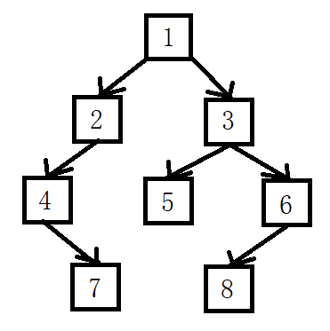
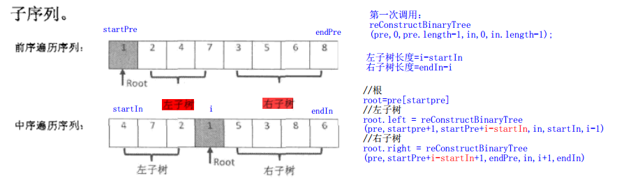

# 重建二叉树

## 题目

输入某二叉树的前序遍历和中序遍历的结果，请重建该二叉树。假设输入的前序遍历和中序遍历的结果中都不含重复的数字。例如，输入前序遍历序列{1，2，4，7，3，5，6，8}和中序遍历序列{4，7，2，1，5，3，8，6}，则重建如图1所示的二叉树并输出它的头节点。



二叉树节点的定义如下：

```c++
struct BinaryTreeNode
{
    int m_nValue;
    BinaryTreeNode* m_pLeft;
    BinaryTreeNode* m_pRight;
};
```

## 题解

```java
public class test {
    public static void main(String[] args) {
        int[] pre = {1, 2, 4, 7, 3, 5, 6, 8};
        int[] in = {4, 7, 2, 1, 5, 3, 8, 6};
        reConstructBinaryTree(pre, in);
    }

    public static TreeNode reConstructBinaryTree(int[] pre, int[] in) {
        TreeNode root = reConstructBinaryTree(pre, 0, pre.length - 1, in, 0, in.length - 1);
        return root;
    }

    private static TreeNode reConstructBinaryTree(int[] pre, int startPre, int endPre, int[] in, int startIn, int endIn) {
        if (startPre > endPre || startIn > endIn) {
            return null;
        }
        TreeNode root = new TreeNode(pre[startPre]);
        for (int i = startIn; i <= endIn; i++) {
            if (in[i] == pre[startPre]) {
                root.left = reConstructBinaryTree(pre, startPre + 1, startPre + i - startIn, in, startIn, i - 1);
                root.right = reConstructBinaryTree(pre, startPre + i - startIn + 1, endPre, in, i + 1, endIn);
                break;
            }
        }
        return root;
    }
}

//二叉树节点
class TreeNode {
    int val;
    TreeNode left;
    TreeNode right;

    TreeNode(int val) {
        this.val = val;
    }
}
```

[题解思路，来自牛客网](https://www.nowcoder.com/questionTerminal/8a19cbe657394eeaac2f6ea9b0f6fcf6)
