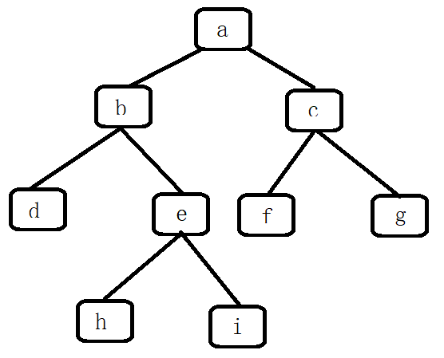

# 二叉树的下一个节点

## 题目

给定一颗二叉树和其中的一个节点，如何找出中序遍历序列的下一个节点？树中的节点除了有两个分别指向左、右子节点的指针，还有一个指向父节点的指针。



## 题解

```java
/*
public class TreeLinkNode {
    int val;
    TreeLinkNode left = null;
    TreeLinkNode right = null;
    TreeLinkNode next = null;

    TreeLinkNode(int val) {
        this.val = val;
    }
}
*/
public class Solution {
    public TreeLinkNode GetNext(TreeLinkNode pNode)
    {
        if (pNode == null) {
            return null;
        }

        if (pNode.right != null) {
            pNode = pNode.right;
            while (pNode.left != null){
                pNode = pNode.left;
            }
            return pNode;
        }

        while (pNode.next != null) {
            if (pNode.next.left == pNode) {
                return pNode.next;
            }
            pNode = pNode.next;
        }

        return null;
    }
}
```
